# Lab 01 Report - Introduction to Open Source Software

# 6. 10 Open Source Definition:
	The importance of this definition is to make sure that there is a freedom to the code/project.
	That there isnt many restrictions on how the source code is used, modified, and provided.

# 7. Smart Questions:
	1.Try to see what the person knows already
	2.Make sure you detail your steps to the solutions

# 8. Free Culture:
	The biggest thing that I got out of the reading was the unintended consequences that you have to deal with
	when developing. Just as the story shows, Jesse set out with the goal of better connecting his school's
	intranetwork. He brought on the assistence of a officially developed Microsoft software to help with his endeavor
	and only made minor fixes. However, it had publically shared folders in which students used to share music files. 
	Since he did nothing to remedy this issue, he was approached with a law suit which would not be easy to get out of. It shows
	that you have to be careful in every aspect of developing anything and need to think how your software could be used
	maliciously or exploited for illegal use.

# 13 Linux Tree Install
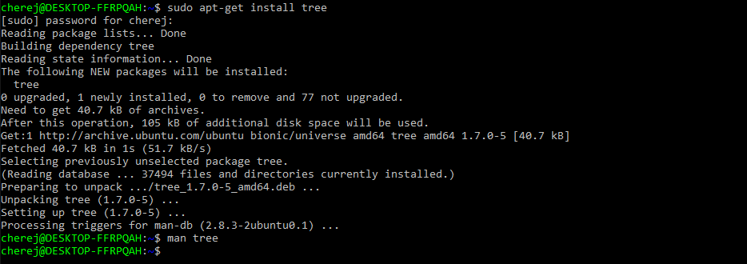

# 15 Regex Problems
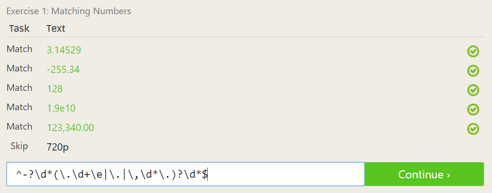
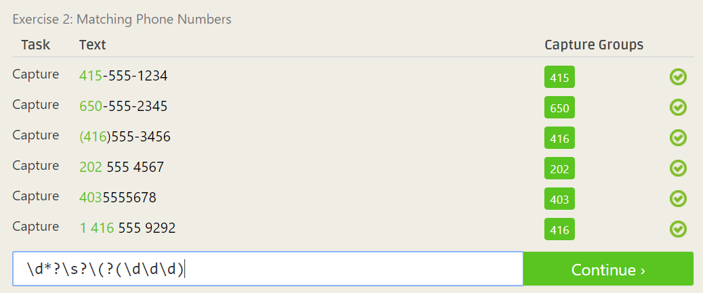
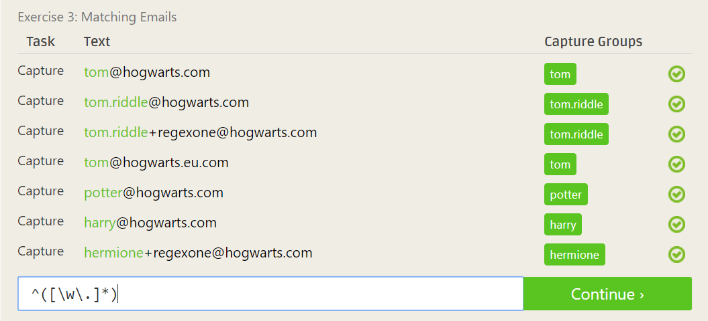
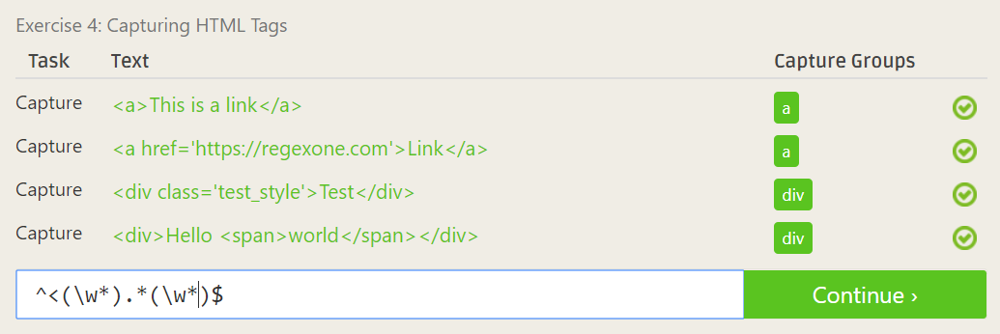
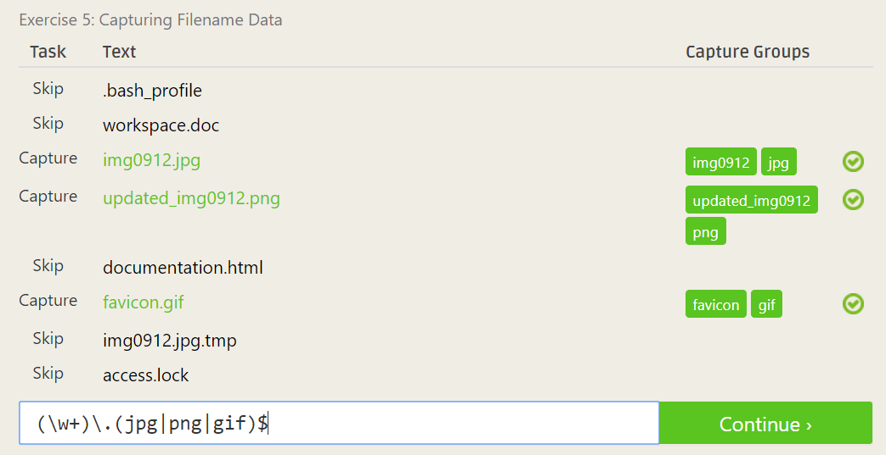
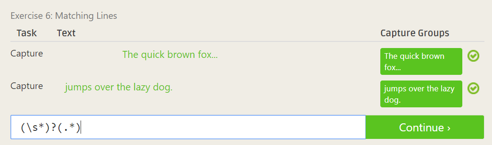
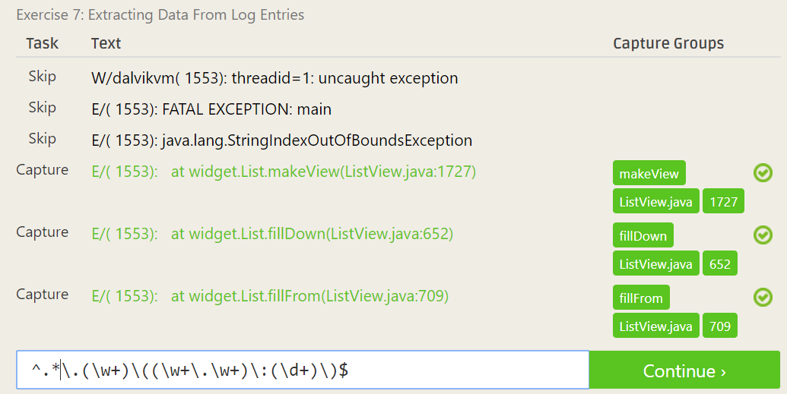

# 16 Regex Crossword Puzzles
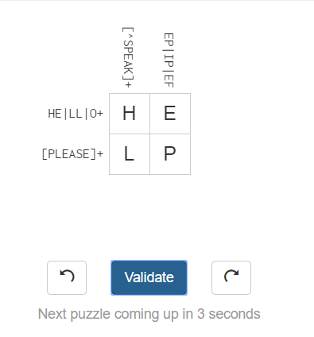
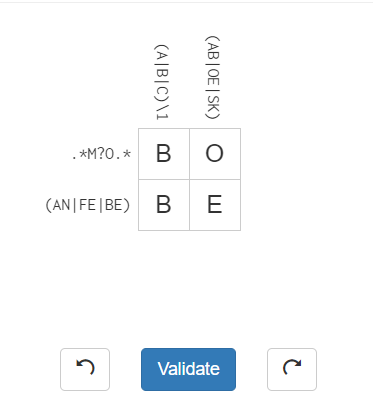
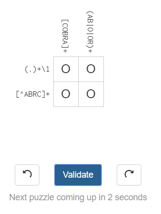
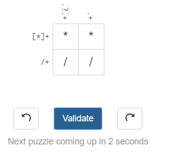

# 18. Blocky Maze
	Heres the Code and the successful run.
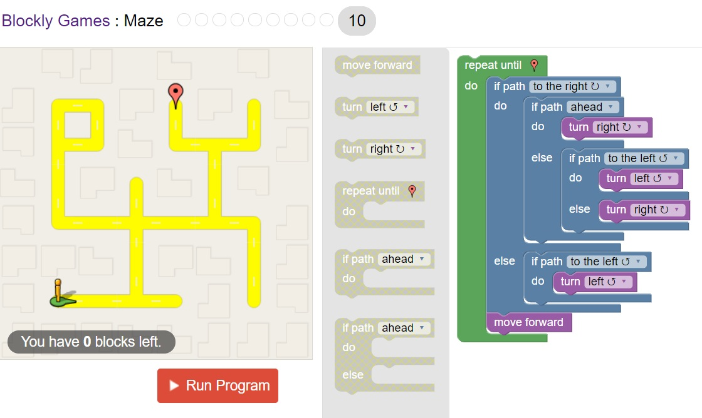
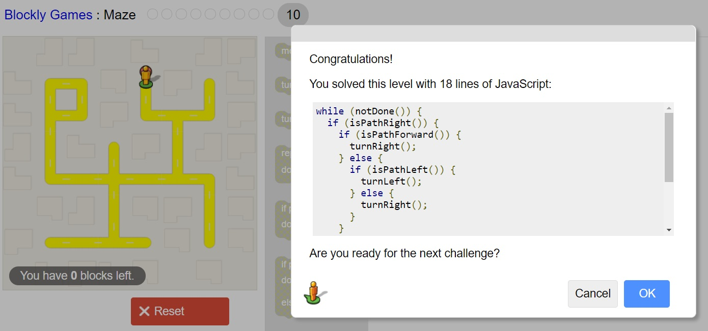

# 19. Reflection
	https://github.com/SaltieRL/carball
	I've been interested in this Open Source project and using if for a project of my own. It is a open source project which can 
	unpack these replay files for the game Rocket League and spit out relevant data about the specifics of the game. Using this
	tool I can run data tests on each individual game and find tendencies that particular players have. It can also be used to 
	identify whether certain decisions or plays lead to desirable or less desirable outcomes. In doing so I would like to find out
	whether you can quantify what goes into high level play and what seperates the good players from the best. This would be similar 
	how professional sports are moving to data analytics to help quantify players, however using this tool you can more easily get
	the stats and even create new stats to find out such things.
	
