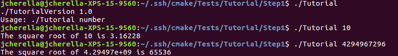

# Lab 5

## Step 1
  Tutorial.cxx
```
  #include <cmath>
  #include <cstdlib>
  #include <iostream>
  #include <string>

  #include "TutorialConfig.h"

  int main(int argc, char* argv[])
  {
    if (argc < 2) {
      std::cout << argv[0] << "Version "<< Tutorial_VERSION_MAJOR << "." << Tutorial_VERSION_MINOR << std::endl;
      std::cout << "Usage: " << argv[0] << " number" << std::endl;
      return 1;
    }
    double inputValue = std::stod(argv[1]);
    double outputValue = sqrt(inputValue);
    std::cout << "The square root of " << inputValue << " is " << outputValue
            << std::endl;
    return 0;
  }
```

  CMakeLists.txt
```
cmake_minimum_required(VERSION 3.3)
project(Tutorial)

# the version Number
set(Tutorial_VERSION_MAJOR 1)
set(Tutorial_VERSION_MINOR 0)
set(CMAKE_CXX_STANDARD 11)
set(CMAKE_CXX_STANDARD_REQUIRED True)

configure_file(
        "${PROJECT_SOURCE_DIR}/TutorialConfig.h.in"
        "${PROJECT_BINARY_DIR}/TutorialConfig.h"
)

add_executable(Tutorial tutorial.cxx)

target_include_directories(Tutorial PUBLIC
        "${PROJECT_BINARY_DIR}"
)
```
  Output
  
  
  
## Step 2
  tutorial.cxx
```
#include <cmath>
#include <iostream>
#include <string>

#include "TutorialConfig.h"

int main(int argc, char* argv[])
{
  if (argc < 2) {
    std::cout << argv[0] << " Version " << Tutorial_VERSION_MAJOR << "."
              << Tutorial_VERSION_MINOR << std::endl;
    std::cout << "Usage: " << argv[0] << " number" << std::endl;
    return 1;
  }

  double inputValue = std::stod(argv[1]);

  #ifdef USE_MYMATH
    double outputValue = mysqrt(inputValue);
  #else
    double outputValue = sqrt(inputValue);
  #endif

  std::cout << "The square root of " << inputValue << " is " << outputValue
            << std::endl;
  return 0;
}
```
  CMakeLists.txt
```
cmake_minimum_required(VERSION 3.3)
project(Tutorial)

set(CMAKE_CXX_STANDARD 14)
# the version number.
set(Tutorial_VERSION_MAJOR 1)
set(Tutorial_VERSION_MINOR 0)

# configure a header file to pass some of the CMake settings
# to the source code
configure_file(
  "${PROJECT_SOURCE_DIR}/TutorialConfig.h.in"
  "${PROJECT_BINARY_DIR}/TutorialConfig.h"
  )

option(USE_MYMATH "Use tutorial provided math implementation" ON)

if(USE_MYMATH)
  add_subdirectory(MathFunctions)
  list(APPEND EXTRA_LIBS MathFunctions)
  list(APPEND EXTRA_INCLUDES "${PROJECT_SOURCE_DIR}/MathFunctions")
endif(USE_MYMATH)

# add the executable
add_executable(Tutorial tutorial.cxx)

target_link_libraries(Tutorial ${EXTRA_LIBS})

# add the binary tree to the search path for include files
# so that we will find TutorialConfig.h
target_include_directories(Tutorial PUBLIC
                           "${PROJECT_BINARY_DIR}"
                           )

```
  Output
  

## Step 3
  CMakeLists.txt
```
cmake_minimum_required(VERSION 3.3)
project(Tutorial)

set(CMAKE_CXX_STANDARD 14)

# should we use our own math functions
option(USE_MYMATH "Use tutorial provided math implementation" ON)

# the version number.
set(Tutorial_VERSION_MAJOR 1)
set(Tutorial_VERSION_MINOR 0)

# configure a header file to pass some of the CMake settings
# to the source code
configure_file(
  "${PROJECT_SOURCE_DIR}/TutorialConfig.h.in"
  "${PROJECT_BINARY_DIR}/TutorialConfig.h"
  )

if(USE_MYMATH)
  add_subdirectory(MathFunctions)
  list(APPEND EXTRA_LIBS MathFunctions)
endif(USE_MYMATH)

# add the executable
add_executable(Tutorial tutorial.cxx)

target_link_libraries(Tutorial ${EXTRA_LIBS})

# add the binary tree to the search path for include files
# so that we will find TutorialConfig.h
target_include_directories(Tutorial PUBLIC
                           "${PROJECT_BINARY_DIR}"
                           )
```
  MathFunctions/CMakeLists.txt
```
dd_library(MathFunctions mysqrt.cxx)

target_include_directories(MathFunctions
            INTERFACE ${CMAKE_CURRENT_SOURCE_DIR})
```
  Output 
  
  
## Step 4
  CMakeLists.txt
```
cmake_minimum_required(VERSION 3.3)
project(Tutorial)

set(CMAKE_CXX_STANDARD 14)

# should we use our own math functions
option(USE_MYMATH "Use tutorial provided math implementation" ON)

# the version number.
set(Tutorial_VERSION_MAJOR 1)
set(Tutorial_VERSION_MINOR 0)

# configure a header file to pass some of the CMake settings
# to the source code
configure_file(
  "${PROJECT_SOURCE_DIR}/TutorialConfig.h.in"
  "${PROJECT_BINARY_DIR}/TutorialConfig.h"
  )

# add the MathFunctions library?
if(USE_MYMATH)
  add_subdirectory(MathFunctions)
  list(APPEND EXTRA_LIBS MathFunctions)
endif(USE_MYMATH)

# add the executable
add_executable(Tutorial tutorial.cxx)
install(TARGETS Tutorial DESTINATION bin)
install(FILES "${PROJECT_BINARY_DIR}/TutorialConfig.h"
          DESTINATION include
          )


# add the binary tree to the search path for include files
# so that we will find TutorialConfig.h
target_include_directories(Tutorial PUBLIC
                           "${PROJECT_BINARY_DIR}"
                           )

# enable testing
enable_testing()

# does the application run
add_test(NAME Runs COMMAND Tutorial 25)

# does the usage message work?
add_test(NAME Usage COMMAND Tutorial)
set_tests_properties(Usage
  PROPERTIES PASS_REGULAR_EXPRESSION "Usage:.*number"
  )

# define a function to simplify adding tests
function(do_test target arg result)
  add_test(NAME Comp${arg} COMMAND ${target} ${arg})
  set_tests_properties(Comp${arg}
    PROPERTIES PASS_REGULAR_EXPRESSION ${result}
    )
endfunction(do_test)

# do a bunch of result based tests
do_test(Tutorial 25 "25 is 5")
do_test(Tutorial -25 "-25 is [-nan|nan|0]")
do_test(Tutorial 0.0001 "0.0001 is 0.01")
```
  MathFunctions/CMakeLists.txt
```
add_library(MathFunctions mysqrt.cxx)

install (TARGETS MathFunctions DESTINATION bin)
install (FILES MathFunctions.h DESTINATION include)

# state that anybody linking to us needs to include the current source dir
# to find MathFunctions.h, while we don't.
target_include_directories(MathFunctions
          INTERFACE ${CMAKE_CURRENT_SOURCE_DIR}
          )
```
  Output
  
  
## Step 5
  CMakeLists.txt
```
cmake_minimum_required(VERSION 3.3)
project(Tutorial)

set(CMAKE_CXX_STANDARD 14)

# should we use our own math functions
option(USE_MYMATH "Use tutorial provided math implementation" ON)

# the version number.
set(Tutorial_VERSION_MAJOR 1)
set(Tutorial_VERSION_MINOR 0)

# configure a header file to pass some of the CMake settings
# to the source code
configure_file(
  "${PROJECT_SOURCE_DIR}/TutorialConfig.h.in"
  "${PROJECT_BINARY_DIR}/TutorialConfig.h"
  )

# add the MathFunctions library?
if(USE_MYMATH)
  add_subdirectory(MathFunctions)
  list(APPEND EXTRA_LIBS MathFunctions)
endif()

# add the executable
add_executable(Tutorial tutorial.cxx)
target_link_libraries(Tutorial PUBLIC ${EXTRA_LIBS})

# add the binary tree to the search path for include files
# so that we will find TutorialConfig.h
target_include_directories(Tutorial PUBLIC
                           "${PROJECT_BINARY_DIR}"
                           )

# add the install targets
install(TARGETS Tutorial DESTINATION bin)
install(FILES "${PROJECT_BINARY_DIR}/TutorialConfig.h"
  DESTINATION include
  )

# enable testing
enable_testing()

# does the application run
add_test(NAME Runs COMMAND Tutorial 25)

# does the usage message work?
add_test(NAME Usage COMMAND Tutorial)
set_tests_properties(Usage
  PROPERTIES PASS_REGULAR_EXPRESSION "Usage:.*number"
  )

# define a function to simplify adding tests
function(do_test target arg result)
  add_test(NAME Comp${arg} COMMAND ${target} ${arg})
  set_tests_properties(Comp${arg}
     PROPERTIES PASS_REGULAR_EXPRESSION ${result}
    )
endfunction(do_test)

# do a bunch of result based tests
do_test(Tutorial 4 "4 is 2")
do_test(Tutorial 9 "9 is 3")
do_test(Tutorial 5 "5 is 2.236")
do_test(Tutorial 7 "7 is 2.645")
do_test(Tutorial 25 "25 is 5")
do_test(Tutorial -25 "-25 is [-nan|nan|0]")
do_test(Tutorial 0.0001 "0.0001 is 0.01")

# does this system provide the log and exp functions?
include(CheckSymbolExists)
set(CMAKE_REQUIRED_LIBRARIES "m")
check_symbol_exists(log "math.h" HAVE_LOG)
check_symbol_exists(exp "math.h" HAVE_EXP)
```
  MathFunctions/CMakeLists.txt
```
add_library(MathFunctions mysqrt.cxx)

# state that anybody linking to us needs to include the current source dir
# to find MathFunctions.h, while we don't.
target_include_directories(MathFunctions
          INTERFACE ${CMAKE_CURRENT_SOURCE_DIR}
          PRIVATE ${Tutorial_BINARY_DIR}
          )

install(TARGETS MathFunctions DESTINATION lib)
install(FILES MathFunctions.h DESTINATION include)
```
  Output
  
  
## Lab-Example
  Makefile
```
all: dynamic_block static_block
clean:
        rm *.o *.so dynamic_block static_block
dynamic_block: ../headers/block.h libblock.so
        cc block.o libblock.so -o dynamic_block -Wl,-rpath=''
 
static_block: ../headers/block.h libstat.a
        cc block.o libstat.a -o static_block

libblock.so: ../headers/block.h ../program.c
        cc -shared -o libblock.so ../headers/block.h ../program.c

libstat.a: ../headers/block.h ../program.c
        ar rcs libstat.a ../headers/block.h ../program.c

libs: libblock.so libstat.a

```
  CMakeLists.txt
```
cmake_minimum_required(VERSION 3.0)
project(block C)

add_library(libblock SHARED block.c ../program.c ../headers/block.h)
add_library(libstat STATIC block.c ../program.c ../headers/block.h)

add_executable(dynamic_block block.c ../program.c)
target_link_libraries(dynamic_block libblock)

add_executable(static_block block.c ../program.c)
target_link_libraries(static_block libstat)

```
  Makefile generated by Cmake
```
# CMAKE generated file: DO NOT EDIT!
# Generated by "Unix Makefiles" Generator, CMake Version 3.5

# Default target executed when no arguments are given to make.
default_target: all

.PHONY : default_target

# Allow only one "make -f Makefile2" at a time, but pass parallelism.
.NOTPARALLEL:


#=============================================================================
# Special targets provided by cmake.

# Disable implicit rules so canonical targets will work.
.SUFFIXES:


# Remove some rules from gmake that .SUFFIXES does not remove.
SUFFIXES =

.SUFFIXES: .hpux_make_needs_suffix_list


# Suppress display of executed commands.
$(VERBOSE).SILENT:


# A target that is always out of date.
cmake_force:

.PHONY : cmake_force

#=============================================================================
# Set environment variables for the build.

# The shell in which to execute make rules.
SHELL = /bin/sh

# The CMake executable.
CMAKE_COMMAND = /usr/bin/cmake

# The command to remove a file.
RM = /usr/bin/cmake -E remove -f

# Escaping for special characters.
EQUALS = =

# The top-level source directory on which CMake was run.
CMAKE_SOURCE_DIR = /home/jcherella/.ssh/CSCI-49XX-OpenSource/Modules/BuildSystems/Lab-Example/source

# The top-level build directory on which CMake was run.
CMAKE_BINARY_DIR = /home/jcherella/.ssh/CSCI-49XX-OpenSource/Modules/BuildSystems/Lab-Example/build

#=============================================================================
# Targets provided globally by CMake.

# Special rule for the target edit_cache
edit_cache:
	@$(CMAKE_COMMAND) -E cmake_echo_color --switch=$(COLOR) --cyan "No interactive CMake dialog available..."
	/usr/bin/cmake -E echo No\ interactive\ CMake\ dialog\ available.
.PHONY : edit_cache

# Special rule for the target edit_cache
edit_cache/fast: edit_cache

.PHONY : edit_cache/fast

# Special rule for the target rebuild_cache
rebuild_cache:
	@$(CMAKE_COMMAND) -E cmake_echo_color --switch=$(COLOR) --cyan "Running CMake to regenerate build system..."
	/usr/bin/cmake -H$(CMAKE_SOURCE_DIR) -B$(CMAKE_BINARY_DIR)
.PHONY : rebuild_cache

# Special rule for the target rebuild_cache
rebuild_cache/fast: rebuild_cache

.PHONY : rebuild_cache/fast

# The main all target
all: cmake_check_build_system
	$(CMAKE_COMMAND) -E cmake_progress_start /home/jcherella/.ssh/CSCI-49XX-OpenSource/Modules/BuildSystems/Lab-Example/build/CMakeFiles /home/jcherella/.ssh/CSCI-49XX-OpenSource/Modules/BuildSystems/Lab-Example/build/CMakeFiles/progress.marks
	$(MAKE) -f CMakeFiles/Makefile2 all
	$(CMAKE_COMMAND) -E cmake_progress_start /home/jcherella/.ssh/CSCI-49XX-OpenSource/Modules/BuildSystems/Lab-Example/build/CMakeFiles 0
.PHONY : all

# The main clean target
clean:
	$(MAKE) -f CMakeFiles/Makefile2 clean
.PHONY : clean

# The main clean target
clean/fast: clean

.PHONY : clean/fast

# Prepare targets for installation.
preinstall: all
	$(MAKE) -f CMakeFiles/Makefile2 preinstall
.PHONY : preinstall

# Prepare targets for installation.
preinstall/fast:
	$(MAKE) -f CMakeFiles/Makefile2 preinstall
.PHONY : preinstall/fast

# clear depends
depend:
	$(CMAKE_COMMAND) -H$(CMAKE_SOURCE_DIR) -B$(CMAKE_BINARY_DIR) --check-build-system CMakeFiles/Makefile.cmake 1
.PHONY : depend

#=============================================================================
# Target rules for targets named libblock

# Build rule for target.
libblock: cmake_check_build_system
	$(MAKE) -f CMakeFiles/Makefile2 libblock
.PHONY : libblock

# fast build rule for target.
libblock/fast:
	$(MAKE) -f CMakeFiles/libblock.dir/build.make CMakeFiles/libblock.dir/build
.PHONY : libblock/fast

#=============================================================================
# Target rules for targets named static_block

# Build rule for target.
static_block: cmake_check_build_system
	$(MAKE) -f CMakeFiles/Makefile2 static_block
.PHONY : static_block

# fast build rule for target.
static_block/fast:
	$(MAKE) -f CMakeFiles/static_block.dir/build.make CMakeFiles/static_block.dir/build
.PHONY : static_block/fast

#=============================================================================
# Target rules for targets named libstat

# Build rule for target.
libstat: cmake_check_build_system
	$(MAKE) -f CMakeFiles/Makefile2 libstat
.PHONY : libstat

# fast build rule for target.
libstat/fast:
	$(MAKE) -f CMakeFiles/libstat.dir/build.make CMakeFiles/libstat.dir/build
.PHONY : libstat/fast

#=============================================================================
# Target rules for targets named dynamic_block

# Build rule for target.
dynamic_block: cmake_check_build_system
	$(MAKE) -f CMakeFiles/Makefile2 dynamic_block
.PHONY : dynamic_block

# fast build rule for target.
dynamic_block/fast:
	$(MAKE) -f CMakeFiles/dynamic_block.dir/build.make CMakeFiles/dynamic_block.dir/build
.PHONY : dynamic_block/fast

block.o: block.c.o

.PHONY : block.o

# target to build an object file
block.c.o:
	$(MAKE) -f CMakeFiles/libblock.dir/build.make CMakeFiles/libblock.dir/block.c.o
	$(MAKE) -f CMakeFiles/static_block.dir/build.make CMakeFiles/static_block.dir/block.c.o
	$(MAKE) -f CMakeFiles/libstat.dir/build.make CMakeFiles/libstat.dir/block.c.o
	$(MAKE) -f CMakeFiles/dynamic_block.dir/build.make CMakeFiles/dynamic_block.dir/block.c.o
.PHONY : block.c.o

block.i: block.c.i

.PHONY : block.i

# target to preprocess a source file
block.c.i:
	$(MAKE) -f CMakeFiles/libblock.dir/build.make CMakeFiles/libblock.dir/block.c.i
	$(MAKE) -f CMakeFiles/static_block.dir/build.make CMakeFiles/static_block.dir/block.c.i
	$(MAKE) -f CMakeFiles/libstat.dir/build.make CMakeFiles/libstat.dir/block.c.i
	$(MAKE) -f CMakeFiles/dynamic_block.dir/build.make CMakeFiles/dynamic_block.dir/block.c.i
.PHONY : block.c.i

block.s: block.c.s

.PHONY : block.s

# target to generate assembly for a file
block.c.s:
	$(MAKE) -f CMakeFiles/libblock.dir/build.make CMakeFiles/libblock.dir/block.c.s
	$(MAKE) -f CMakeFiles/static_block.dir/build.make CMakeFiles/static_block.dir/block.c.s
	$(MAKE) -f CMakeFiles/libstat.dir/build.make CMakeFiles/libstat.dir/block.c.s
	$(MAKE) -f CMakeFiles/dynamic_block.dir/build.make CMakeFiles/dynamic_block.dir/block.c.s
.PHONY : block.c.s

home/jcherella/.ssh/CSCI-49XX-OpenSource/Modules/BuildSystems/Lab-Example/program.o: home/jcherella/.ssh/CSCI-49XX-OpenSource/Modules/BuildSystems/Lab-Example/program.c.o

.PHONY : home/jcherella/.ssh/CSCI-49XX-OpenSource/Modules/BuildSystems/Lab-Example/program.o

# target to build an object file
home/jcherella/.ssh/CSCI-49XX-OpenSource/Modules/BuildSystems/Lab-Example/program.c.o:
	$(MAKE) -f CMakeFiles/libblock.dir/build.make CMakeFiles/libblock.dir/home/jcherella/.ssh/CSCI-49XX-OpenSource/Modules/BuildSystems/Lab-Example/program.c.o
	$(MAKE) -f CMakeFiles/static_block.dir/build.make CMakeFiles/static_block.dir/home/jcherella/.ssh/CSCI-49XX-OpenSource/Modules/BuildSystems/Lab-Example/program.c.o
	$(MAKE) -f CMakeFiles/libstat.dir/build.make CMakeFiles/libstat.dir/home/jcherella/.ssh/CSCI-49XX-OpenSource/Modules/BuildSystems/Lab-Example/program.c.o
	$(MAKE) -f CMakeFiles/dynamic_block.dir/build.make CMakeFiles/dynamic_block.dir/home/jcherella/.ssh/CSCI-49XX-OpenSource/Modules/BuildSystems/Lab-Example/program.c.o
.PHONY : home/jcherella/.ssh/CSCI-49XX-OpenSource/Modules/BuildSystems/Lab-Example/program.c.o

home/jcherella/.ssh/CSCI-49XX-OpenSource/Modules/BuildSystems/Lab-Example/program.i: home/jcherella/.ssh/CSCI-49XX-OpenSource/Modules/BuildSystems/Lab-Example/program.c.i

.PHONY : home/jcherella/.ssh/CSCI-49XX-OpenSource/Modules/BuildSystems/Lab-Example/program.i

# target to preprocess a source file
home/jcherella/.ssh/CSCI-49XX-OpenSource/Modules/BuildSystems/Lab-Example/program.c.i:
	$(MAKE) -f CMakeFiles/libblock.dir/build.make CMakeFiles/libblock.dir/home/jcherella/.ssh/CSCI-49XX-OpenSource/Modules/BuildSystems/Lab-Example/program.c.i
	$(MAKE) -f CMakeFiles/static_block.dir/build.make CMakeFiles/static_block.dir/home/jcherella/.ssh/CSCI-49XX-OpenSource/Modules/BuildSystems/Lab-Example/program.c.i
	$(MAKE) -f CMakeFiles/libstat.dir/build.make CMakeFiles/libstat.dir/home/jcherella/.ssh/CSCI-49XX-OpenSource/Modules/BuildSystems/Lab-Example/program.c.i
	$(MAKE) -f CMakeFiles/dynamic_block.dir/build.make CMakeFiles/dynamic_block.dir/home/jcherella/.ssh/CSCI-49XX-OpenSource/Modules/BuildSystems/Lab-Example/program.c.i
.PHONY : home/jcherella/.ssh/CSCI-49XX-OpenSource/Modules/BuildSystems/Lab-Example/program.c.i

home/jcherella/.ssh/CSCI-49XX-OpenSource/Modules/BuildSystems/Lab-Example/program.s: home/jcherella/.ssh/CSCI-49XX-OpenSource/Modules/BuildSystems/Lab-Example/program.c.s

.PHONY : home/jcherella/.ssh/CSCI-49XX-OpenSource/Modules/BuildSystems/Lab-Example/program.s

# target to generate assembly for a file
home/jcherella/.ssh/CSCI-49XX-OpenSource/Modules/BuildSystems/Lab-Example/program.c.s:
	$(MAKE) -f CMakeFiles/libblock.dir/build.make CMakeFiles/libblock.dir/home/jcherella/.ssh/CSCI-49XX-OpenSource/Modules/BuildSystems/Lab-Example/program.c.s
	$(MAKE) -f CMakeFiles/static_block.dir/build.make CMakeFiles/static_block.dir/home/jcherella/.ssh/CSCI-49XX-OpenSource/Modules/BuildSystems/Lab-Example/program.c.s
	$(MAKE) -f CMakeFiles/libstat.dir/build.make CMakeFiles/libstat.dir/home/jcherella/.ssh/CSCI-49XX-OpenSource/Modules/BuildSystems/Lab-Example/program.c.s
	$(MAKE) -f CMakeFiles/dynamic_block.dir/build.make CMakeFiles/dynamic_block.dir/home/jcherella/.ssh/CSCI-49XX-OpenSource/Modules/BuildSystems/Lab-Example/program.c.s
.PHONY : home/jcherella/.ssh/CSCI-49XX-OpenSource/Modules/BuildSystems/Lab-Example/program.c.s

# Help Target
help:
	@echo "The following are some of the valid targets for this Makefile:"
	@echo "... all (the default if no target is provided)"
	@echo "... clean"
	@echo "... depend"
	@echo "... edit_cache"
	@echo "... rebuild_cache"
	@echo "... libblock"
	@echo "... static_block"
	@echo "... libstat"
	@echo "... dynamic_block"
	@echo "... block.o"
	@echo "... block.i"
	@echo "... block.s"
	@echo "... home/jcherella/.ssh/CSCI-49XX-OpenSource/Modules/BuildSystems/Lab-Example/program.o"
	@echo "... home/jcherella/.ssh/CSCI-49XX-OpenSource/Modules/BuildSystems/Lab-Example/program.i"
	@echo "... home/jcherella/.ssh/CSCI-49XX-OpenSource/Modules/BuildSystems/Lab-Example/program.s"
.PHONY : help


#=============================================================================
# Special targets to cleanup operation of make.

# Special rule to run CMake to check the build system integrity.
# No rule that depends on this can have commands that come from listfiles
# because they might be regenerated.
cmake_check_build_system:
	$(CMAKE_COMMAND) -H$(CMAKE_SOURCE_DIR) -B$(CMAKE_BINARY_DIR) --check-build-system CMakeFiles/Makefile.cmake 0
.PHONY : cmake_check_build_system
```
  Size of both executables:
```
8784 Jun 28 22:29 dynamic_block
8784 Jun 28 22:29 static_block
```
  Output
  dynamic:
  
  Static:
  
