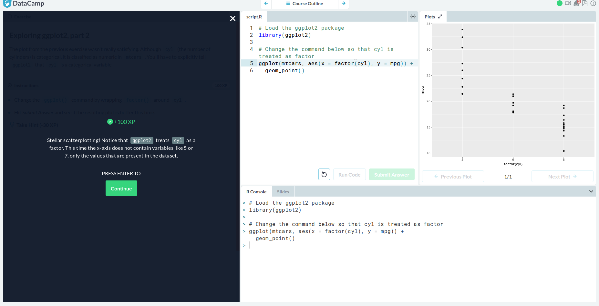
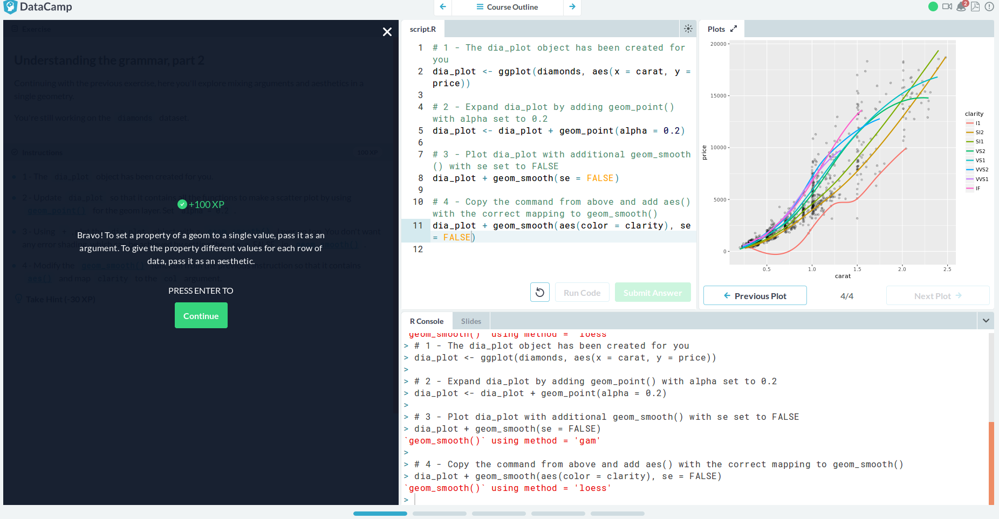

# Data Visualization with ggplot2 (Part 1):
  
  
  
  
  
  
  
  
  
# Multiple and Logistic Regression (Part 2):
  
  
  
  
  
  
  
  
# Project: 
  https://rcos.io/projects/flomv2/flom/profile
