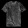

# Checkpoint 1
  
  
# Checkpoint 2
  
  
# Checkpoint 3
  Shirt 1
  
  
  ```
  [[3.2755151e-01 2.1573079e-03 2.5106236e-02 2.4009600e-02 1.3831375e-03
  3.1277006e-05 6.1673343e-01 8.3725225e-13 3.0274412e-03 3.1423421e-18]] 6 Shirt
  ````
  Shirt 2
  
  
  ```
  [[1.6187681e-01 1.1372191e-02 3.0974856e-01 8.1034288e-02 1.9038310e-02
  1.1058047e-02 3.4149817e-01 1.0359614e-06 6.4241834e-02 1.3079149e-04]] 6 Shirt
  ```
  Shirt 3
  
  
  ```
  [[3.9337176e-01 9.8412056e-03 1.9683147e-02 6.2697984e-02 2.1294465e-03
  3.0107817e-06 5.0913709e-01 1.2894279e-09 3.1364062e-03 2.0911595e-10]] 6 Shirt
  ```
