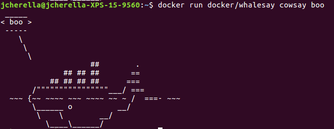
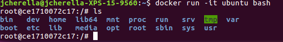
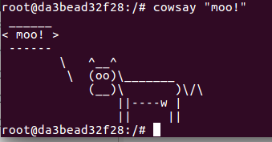
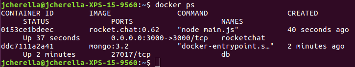
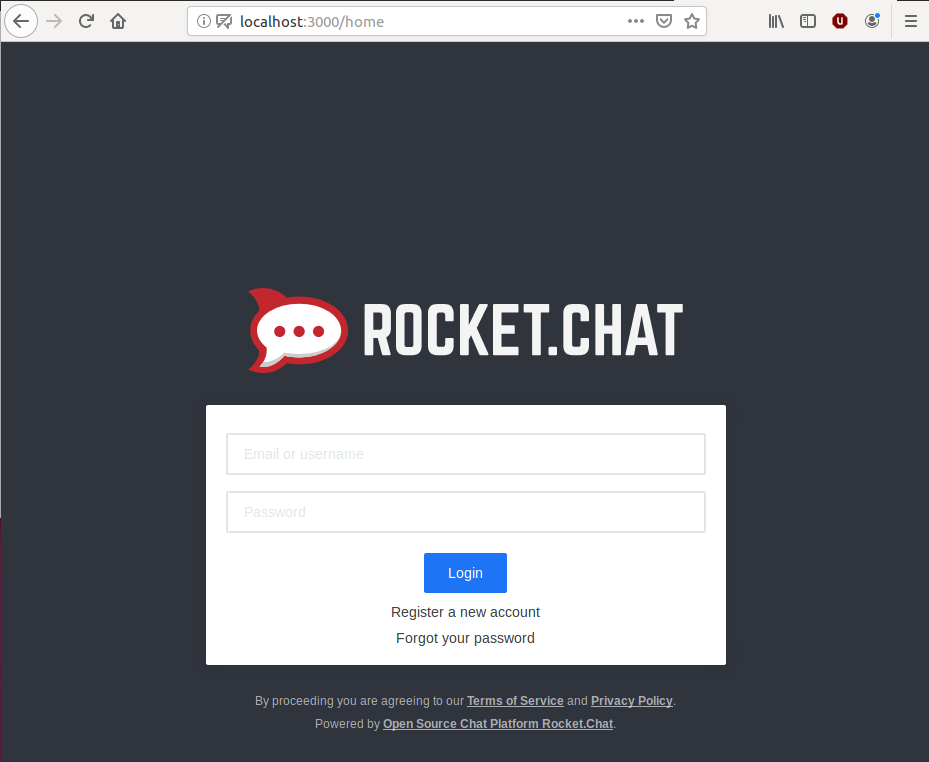
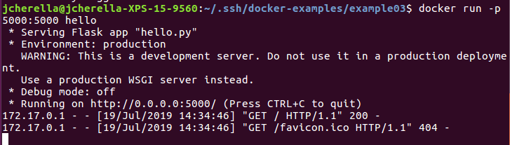
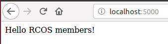

  Docker-Example 00:
  
  
  Docker-Example 01:
  
  
  
  
  Docker-Example 02:
  
  
  
  Docker-Example 03:
```
# Comments in Dockerfiles
FROM python:3.5

ENV hostname=127.0.1.1
# Update and install dependencies
RUN apt-get update
RUN pip install Flask

# Add code
ADD . /opt/webapp/

# Set the working directory
WORKDIR /opt/webapp

# Set environment variables
ENV FLASK_APP=hello.py

# Expose the application's port
EXPOSE 5000

# Run the application
CMD ["flask", "run", "--host=0.0.0.0"]
```
  
  
  
  Docker-Example 04:
  Will be done once Docker stops being garbage.
